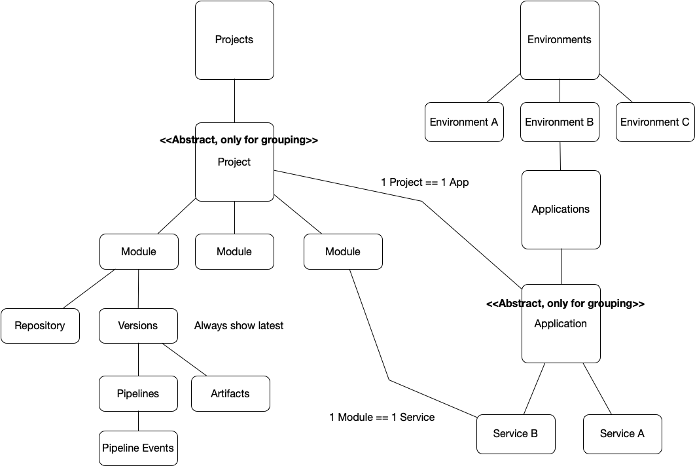

# CD Flow

Simple framework and binary to emit Cloud Events related to Continuous Delivery. 

The idea behind this framework and command-line interface is to empower you  emitting events related to a Continuous Delivery flow to measure performance and gain visibility of your processes. 

## Usage

Download the binary `cdf` or build from source. 

Set `CDF_SINK` environment variable to define where CloudEvents will be sent. You can do this by running:

`export CDF_SINK=http://my-broker` 

Integrate with your existing pipelines, repositories, and environments. 

## Supported Events

Use `cdf --help`

The following events are supported:
- [Project Events]()
  - [Module Events]()
    - [Repository Events](https://github.com/salaboy/cd-flow/#cdf-repository-events)
      - [Issue Events](https://github.com/salaboy/cd-flow/#cdf-issue-events)
      - [Pull Request Events](https://github.com/salaboy/cd-flow/#pull-request-events)
      - [Branch Events](https://github.com/salaboy/cd-flow/#cdf-branch-events)
      - [Tag Events](https://github.com/salaboy/cd-flow/#cdf-tag-events)
- [Environment Events](https://github.com/salaboy/cd-flow/#environment-events)
  - [Application Events]()
    - [Service Events](https://github.com/salaboy/cd-flow/#service-events)
      - [Pipeline Events](https://github.com/salaboy/cd-flow/#pipeline-events)  
        - [Artifact Events](https://github.com/salaboy/cd-flow/#artifact-events)
        - [Container Events](https://github.com/salaboy/cd-flow/#container-events)

- [Infrastructure Events]()  

# CDF Project Events

Use `cdf project --help`

- Base Properties
  - Name
 
### **CDF.Project.Created** Event

Example: `./cdf project created --name my-project` 

### **CDF.Project.Deleted** Event

Example: `./cdf project deleted --name my-project`

## CDF Module Events

Use `cdf module --help`

- Base Properties
  - Name

## CDF Repository Events

Use `cdf repo --help`

- Base Properties
  - Name
  - Url 

### **CDF.Repository.Created** Event 

Example: `./cdf repo created --name my-project --url http://github.com/salaboy/my-project`

### **CDF.Repository.Deleted** Event 

Example: `./cdf repo deleted --name my-project --url http://github.com/salaboy/my-project`

## CDF Issue Events

Use `cdf issue --help`

- Base Properties
  - Id (required)
  - Repository (required)
  - Title 
  - Author 
  
### **CDF.Issue.Created** Event

Example: `./cdf issue created --id 7 --repository my-project --title "new issue" --author salaboy`

### **CDF.Issue.Updated** Event

Example: `./cdf issue updated --id 7 --repository my-project`

### **CDF.Issue.CommentAdded** Event

Example: `./cdf issue commented --id 7 --repository my-project --comment "new comment"`

### **CDF.Issue.Closed** Event

Example: `./cdf issue closed --id 7 --repository my-project`

## Pull Request Events

Use `cdf pr --help`

- Base Properties    
    - PR Id (required)
    - PR Repository (required)
    - Issue Id
    - PR Title

### **CDF.PR.Created** Event

Example: `./cdf pr created --id 42 --repository my-project --author salaboy --title "fixing issue 7"`

### **CDF.PR.Merged** Event

Example: `./cdf pr merged --id 7 --repository my-project`

### **CDF.PR.CommentAdded** Event

Example: `./cdf pr commented --id 7 --repository my-project --comment "hi there from a pr comment"`

## CDF Branch Events

Use `cdf branch --help`

- Base Properties
  - Repository
  - Name
  - Url 

### **CDF.Branch.Created** Event 

Example: `./cdf branch created --name my-branch --repository my-project`

### **CDF.Branch.Deleted** Event 

Example: `./cdf branch deleted --name my-branch --repository my-project`

## CDF Tag Events

Use `cdf tag --help`

- Base Properties
  - Repository
  - Name
  - Url 

### **CDF.Tag.Created** Event 

Example: `./cdf tag created --name 0.0.1 --repository my-project`

### **CDF.Tag.Deleted** Event 

Example: `./cdf tag deleted --name 0.0.1 --repository my-project`

## Pipeline Events

Use `cdf pipeline --help`

- Base Properties
  - Id
  - Name
  - Repository

### **CDF.Pipeline.Started** Event

Example: `./cdf pipeline started --name my-service-pipeline --id UUID-abc-123 --repository my-project`

### **CDF.Pipeline.Finished** Event

Example: `./cdf pipeline finished --name my-service-pipeline --id <UUID> --repository my-project`

### **CDF.Pipeline.Failed** Event

Example: `./cdf pipeline failed --name my-service-pipeline --id <UUID> --repository my-project`

## Artifact Events

Use `cdf artifact --help`

- Base Properties
  - Name
  - Version
  - Source

### **CDF.Artifact.TestStarted** Event

### **CDF.Artifact.TestEnded** Event 
    - Result

### **CDF.Artifact.Built** Event 
    - SHA 
### **CDF.Artifact.VersionUpdated** Event
    - OldVersion
    - NewVersion
### **CDF.Artifact.Released** Event
    - URL
    - Kind
      - Library
      - Service
      
      
## Container Events
- Base Properties
  - Name
  - Organization
  - Tag
  - Repository

### **CDF.Container.Built** Event

### **CDF.Container.Released** Event
  

## Environment Events
- Base Properties
  - URL
  - Repository
  - Name

### **CDF.Environment.Created**

### **CDF.Environment.Updated**

### **CDF.Environment.ServicePromoted**

## Service Events
- Base Properties
  - Name
  - Url
  - Version
  - Environment URL

### **CDF.Service.Deployed** Event

### **CDF.Service.Upgraded** Event

# Example Flow

The following events exemplify a flow and it's different sections:
- **Project Detected/Registered**
  - (Optional it can be inferred) CDF.Project.Created `./cdf project created --name my-project`
  - (Optional it can be inferred) CDF.Module.Created  `./cdf module created --name my-module --project my-project`
    - CDF.Pipeline.Started -> Main objective is to build, test and release an artifact. This pipeline is project scoped. ``
      - CDF.Project.Artifact.Built
      - CDF.Project.Artifact.TestStarted
      - CDF.Project.Artifact.TestEnded
      - CDF.Project.Artifact.Released
    - CDF.Pipeline.Finished
  
- **Promotion To Environment via PR**
  - CDF.Environment.PR.Created
  - CDF.Pipeline.Started -> Main objective is to verify the new version of the artifact and deployment descriptors. This pipeline is environment scoped
  - CDF.Pipeline.Finished
  - CDF.EnvironmentPR.Merged -> To Main branch
- **Environment Upgrade using Pipelines**
  - CDF.Pipeline.Started -> Main objective is to apply the new version deployment descriptors
  - CDF.Pipeline.Finished
  - CDF.Application.Service.UP -> applications are scoped to environments
  - CDF.Application.UP
  
# Metrics
- **Lead Time**
  - **From Source to Development Environment**
  - **From Source to QA Environment**
  - **From Source to Production Environment**
- **Deployment Frequency**
  - **To Development Environment**
  - **To QA Environment**
  - **To Production Environment**
- **Change Fail Rate**
  - **Pipeline Fail**
  - **Deployment Fail**
  - **Issues Reported by Users**
- **Recovery Time**  

# Visualization

